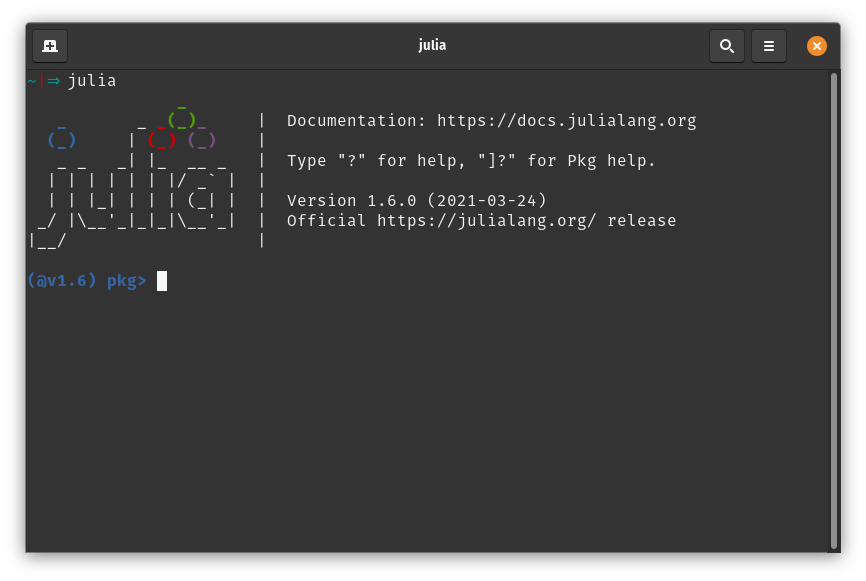

# Altro Tutorials

Welcome to the tutorials site for Altro.jl! This page is dedicated to providing an extensive
suite of useful examples and walkthroughs intended to help newcomers and experienced users
alike. 

!!! note
    While many aspects of the APIs for Altro.jl, TrajectoryOptimization.jl, 
    RobotDynamics.jl, and related packages will be exposed and explained throughout these 
    tutorials, this is not intended to replace the documentation provided by these packages.
    In the event of any discrepancy, the package documentation take precedence.

## Overview of Optimal Control
Optimal control is a powerful class of algorithms aimed at finding optimal control policies
for controlling dynamical systems. Algorithms developed by the optimal control community 
over the last 70 years have been succesfully applied to space systems, rockets, airplanes,
and a wide variety of robotic and autonomous systems. Trajectory optimization is a powerful
sub-field of optimal control where the goal is to find a trajectory that minimizes some 
cost function while obey the system dynamics, as well any additional contraints such as 
actuator or joint limits, operational areas, or obstacle avoidance. 

The packages in the Altro.jl ecosystem are focused on the application of trajectory 
optimization to the field of robotics. These problems typically take the following form:
```math
\begin{aligned}
  \min_{x_{1:N},u_{1:N-1}} \quad & \ell_f(x_N) + \sum_{k=0}^{N-1} \ell_k(x_k, u_k, dt) \\
  \textrm{s.t.}            \quad & x_{k+1} = f(x_k, u_k), \\
                                 & g_k(x_k,u_k) = 0, \\
                                 & h_k(x_k,u_k) \leq_K 0.
\end{aligned}
```
where $x \in \mathbb{R}^n$ and $u \in \mathbb{R}^m$ are the state and control vectors, 
$N$ is the number of knot points, $\ell$ is a cost function, $f(x,u)$ are the system 
dynamics, $g_k(x,u)$ are smooth equality constraints at time step $k$, and $h_k(x_k,u_k)$ 
are generalized inequality constraints at timestep $k$ with respect to the cone $K$.

Critically, optimization problems of this form exhibit *Markovianity*, which in practice 
means that the states and controls at any timestep are only coupled to those at adjacent 
time steps. This property imparts a unique banded structure to the underlying system 
of equations. Leveraging this problem structure is key to good performance. 

## Ecosystem Overview
Altro.jl is one package in a suite of packages developed by the Robotic Exploration Lab
at Stanford and Carnegie Mellon Universities aimed at pushing the computational and 
algorithmic limits of optimal control. The packages are summarized below.

### Core Packages

* RobotDynamics.jl: Provides methods for describing controlled dynamical systems, with 
an emphasis on single rigid bodies. It provides a common Julia interface for querying 
system dynamics and derivatives. Derivatives can be obtained using either automatic 
differentiation or finite differencing.

* TrajectoryOptimization.jl: A convenient API for describing trajectory optimization 
problems. It also provides functionality for evaluating costs, constraints, and their 
derivatives. This interface is intended to be utilized by trajectory optimization solvers 
such as Altro.jl.

* Altro.jl: A state-of-the-art trajectory optimization solver that uses augmented Lagrangian
and iterative LQR (iLQR) to solve general nonlinear, constrained trajectory optimization 
problems. It accepts problems described using TrajectoryOptimization problems.

### Related Packages

* RobotZoo.jl: A set of canonical mathematical models for nonlinear systems, implemented 
within the RobotDynamics interface.

* TrajOptPlots.jl: Provides visualization utilities for TrajectoryOptimization.jl, including
3D visualization via MeshCat.jl.


## Installation
It is very easy to install the TrajectoryOptimization.jl ecosystem using Julia's built-in package manager. 

1. First, you need to install Julia on your computer.   
Go to the Julia [Downloads page](https://julialang.org/downloads/) and download the latest binaries for your operating system. The installation is very straight-forward, but for more specific guidance, see [this page on the Julia website](https://julialang.org/downloads/platform/). 
2. Open a Julia REPL  
Once the `julia` binary is on your system path, you can open the REPL by invoking this binary, e.g. 

       > julia
3. Enter the package manager using the `]` key. It should look like the following:
    
4. Install the packages  
Install the desired packages using the `add` command in the package manager:

        (@v1.6) pkg> add Altro
        (@v1.6) pkg> add TrajectoryOptimization
        (@v1.6) pkg> add RobotDynamics 

    Some other useful packages you may want to install:

        (@v1.6) pkg> add RobotZoo
        (@v1.6) pkg> add TrajOptPlots 
        (@v1.6) pkg> add MeshCat 
        (@v1.6) pkg> add StaticArrays 
        (@v1.6) pkg> add Plots 
        (@v1.6) pkg> add BenchmarkTools 
        (@v1.6) pkg> add Rotations 

    Since Julia `v1.6` the installation process will also precompile these packages for you to decrease the time it takes to load the packages at run-time. Note that when installing `Altro` it also installs `TrajectoryOptimization` and `RobotDynamics` on your system, since these are dependencies. However, you cannot directly use these packages (e.g. `using RobotDynamics`) until you have specifically added them to your environment. For more information on the package manager, as well as working with environments, see the [documentation](https://pkgdocs.julialang.org/v1/).
        

### Why Julia?
Julia is a high-performance language specifically designed for scientific computing. Given it's convenient syntax, excellent package manager, and wealth of high-quality packages for scientific computing, we have found it to be an excellent language for developing novel optimization algorithms. Since the focus of the TrajectoryOptimization.jl ecosystem is primarily the research and development of novel algorithms rather than the development of a production-ready software stack, the JIT (just-in-time compilation) overhead and other minor inconvenciences of working with a high-level scripted language like Julia are minor compared to the benefits. 